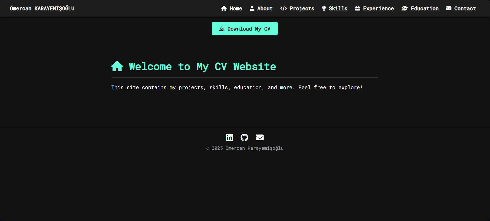
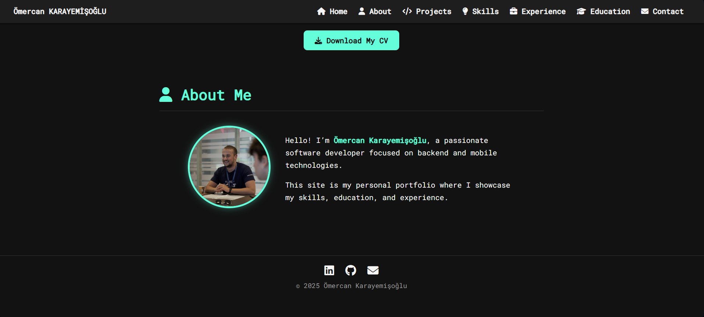
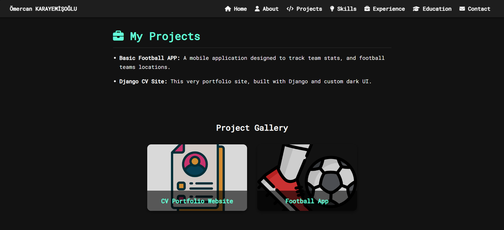
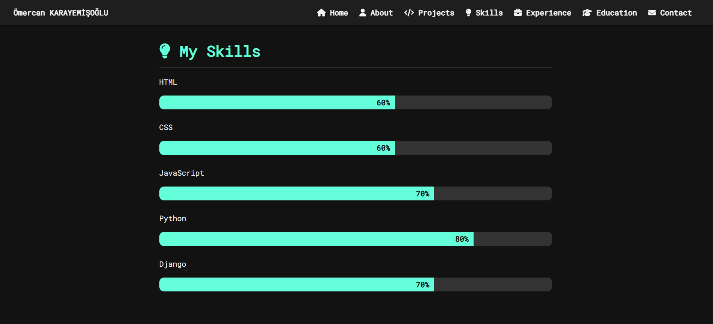
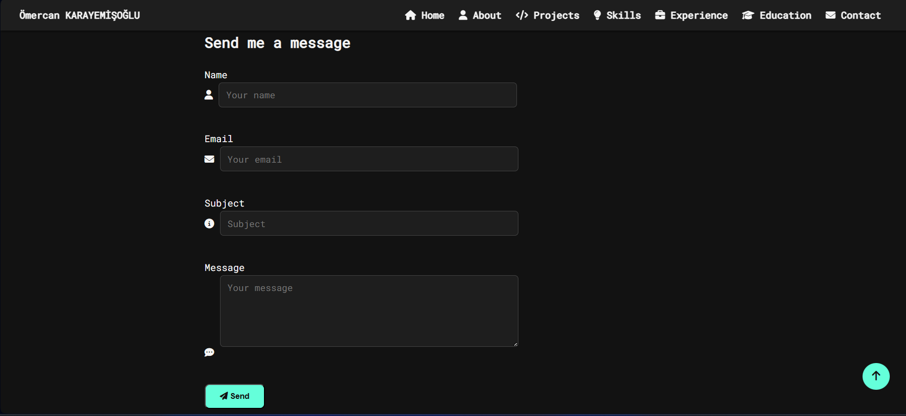

# 🧑‍💼 Ömercan Karayemişoğlu - CV Website

This is my personal CV and portfolio website, designed with a clean dark UI using HTML, CSS, and Django. It includes information about my background, skills, projects, and a contact form.

---

## 🏠 Home Page



---

## 👤 About Me



---

## 💼 Projects



---

## 💡 Skills



---

## ✉️ Contact



---

## 🛠️ Technologies Used

- HTML5 / CSS3
- JavaScript
- Python & Django
- FontAwesome
- Responsive Layout

---

## 📦 How to Run

```bash
git clone https://github.com/omerkry/cvwebsite.git
cd cvwebsite
start index.html

👨‍💻 Author
Ömercan Karayemişoğlu
📧 omercankarayemisoglu@gmail.com
🌐 GitHub | LinkedIn

## 📜 License

This project is licensed under the **MIT License**.

## 🚀 How to Run

You can either run this portfolio as a static HTML website or as a Django project.

---

### 🔹 Option 1: Run as Static Website (HTML/CSS only)

1. Download or clone the repository:
   ```bash
   git clone https://github.com/omerkry/cvwebsite.git
